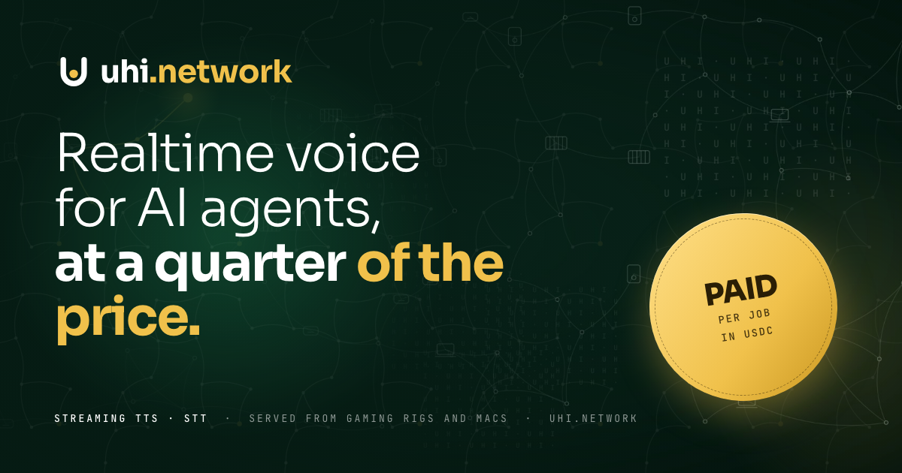

<h3 align="center">Every device is a worker. Every job is a wage.</h3>

<b>UHI</b> (<i>universal high income</i>) is the AI inference network that runs on the devices people already own and pays them for every job. 
Phones, laptops, gaming rigs, consoles, watches and glasses run small, efficient models. Enterprises buy that inference with an SLA. Validators check the work. A Substrate L1 settles every job in seconds for near-zero fees.

| | |
|---|---|
| **Requesters** | buy inference with an SLA: latency, throughput, redundancy, region, privacy. 5–20× cheaper than cloud GPU for small-model work. |
| **Device operators** | run the node, set a battery and thermal budget, earn per job. 70% of every job goes to the device. |
| **Model providers** | publish small, efficient models with a device spec and an SLA envelope; earn a royalty on every job that runs them. |
| **Validators** | stake, verify the work, approve the payout; slashed for approving bad work. |
| **Routers** | match jobs to devices by latency, reputation, price and redundancy; paid to hit the SLA. |

**The people who do the work govern the price of the work.** Three on-chain tracks: protocol, market, treasury.

- Site: [uhi.network](https://uhi.network) · Deck: [deck.uhi.network](https://deck.uhi.network)
- Brand: [`uhi-assets`](https://github.com/uhi-net/uhi-assets) · Site: [`uhi-website`](https://github.com/uhi-net/uhi-website) · Deck: [`uhi-deck`](https://github.com/uhi-net/uhi-deck)
- Siblings: [QuickDial AI](https://quickdial.ai) (USA voice AI, our first workload) · [Vartalaap](https://github.com/vartalaap-si) (India)
